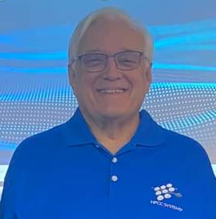
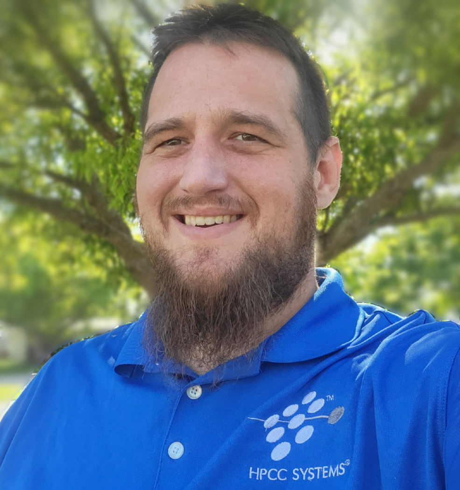

# The Safe Haven ECL Challenge! 
Welcome to another HPCC Systems and ECL Code Challenge!

## Introduction
Many travelers find themselves on occasion in a strange land and a strange city, sometimes without their control. Without knowing the risks and dangers in that area, sometimes a tourist can suddenly be in a dangerous situation. What can we do as developers to help prevent this? 

## The Challenge
Your challenge is to analyze different social factors such as poverty, unemployment, and other factors in US Counties and develop insights and additional information for the traveler.

The goal of the challenge is to provide two important sets of information:

1.	Analysis of social factors in an area (unemployment, education, poverty, and population) and identify it as a "Hot Spot".

2.	Provide additional information to the traveler to help find "safe haven" resources in their area (fire and police stations, hospitals, churches, food banks, etc.).

## The Data
The following public datasets has been collected from all 50 states.

These datasets include:

**Education**

**Unemployment**

**Poverty**

**Population**

**Crime**

**Police**

**Fire Stations**

**Hospitals**

**Places of Worship**

**Food Banks**

Auxiliary Datasets: 

A **Cities** dataset with related FIPS and Zip Codes

**Unemployment Rates** (Not really used in this challenge but interesting data!)

**You are not limited to using these datasets! Extra credit will be rewarded by linking in other pertinent data!**  

## Tools

Start by installing one or both of the following IDEs: 

Install the flagship ECL IDE if you are a Windows user [ECL IDE Install](https://hpccsystems.com/download/#h-bare-metal-non-containerized-platform).

If you have a Mac or Linux box, install the Visual Studio Code IDE for your appropriate O/S, and then refer to the Installation PDF in the Docs folder of this repository to configure your IDE for ECL usage.  
PDFs in the Docs folder of this repository can be found to guide you through the installation and configuration.

[VS-Code IDE Install Page](https://code.visualstudio.com/download).

Download QuickStart.mod located in this repository's root folder. This file has the initial code you need for this challenge. 
The import process will be discussed at the Workshops, but in both IDEs simply open the MOD file and follow the prompts. CTRL+O in the ECL IDE, and the F1 key in VS-Code will pop up the command dialog, and look for the "ECL: Import 'mod' file" command. 

If you need more information on the ECL jobs you are running please use [ECL Watch Page](http://training.us-hpccsystems-dev.azure.lnrsg.io:8010/)

**Note: This cluster will only be active during the event!** After the event, you can create your own localized container cluster, or visit our public "Play" Cluster: (https://play.hpccsystems.com:18010) 

For a quick start on ECL syntax, please visit the [Learn ECL](https://hpccsystems-solutions-lab.github.io/) page. 

## Additional Resources

- ECL training containing six short videos:
https://www.youtube.com/watch?time_continue=192&v=Lk78BCCtM-0

- ECL documentation:
http://cdn.hpccsystems.com/releases/CE-Candidate-9.4.30/docs/EN_US/ECLLanguageReference_EN_US-9.4.30-1.pdf

- Visualization document:
https://cdn.hpccsystems.com/releases/CE-Candidate-9.4.30/docs/EN_US/VisualizingECL_EN_US-9.4.30-1.pdf

- Standard Library:
https://cdn.hpccsystems.com/releases/CE-Candidate-9.4.30/docs/EN_US/ECLStandardLibraryReference_EN_US-9.4.30-1.pdf

- Machine Learning:
https://hpccsystems.com/download/free-modules/machine-learning-library

## Challenge Expectation

Judges will consider the following criteria during your final presentation:

- How did you answer the challenge questions?
- How did you approach the solution?
- What datasets did you use? Did you incorporate any new datasets into the challenge?
- How you presented your results (via ROXIE,Visualization or other medium)- please reference pertinent ECL workunits with submission 
- Drawing conclusions (How did we help find missing children?)
- Demo of work via a PowerPoint presentation or live demo by your team

## Tips for a Great Score

- Since your solution is the key part to this challenge you can use "#OPTION('obfuscateOutput', TRUE);" at the start of your code to hide it from being viewed on ECL Watchpage. If you decide to use #OPTION make sure to remove if from the WUID that you shared with the judges. When obfuscateOutput set to true, details are removed from the generated workunit, including ECL code, estimates of record size, and number of records.
- If you want to write the result to a file, make sure the file name starts with your team's name for uniqueness purpose.
- Make sure the query names are unique and easy to identify. Do not use generic names like test, mentors, or roxie. We suggest adding your team's name as well. General names will result in other teams overwriting your files, queries, and results
- We encourage team play so teams that help answer questions in the public forums will be considered favorably in judging.
- Direct emails and direct messages to judges asking for support will be **ignored** and it won't work in team's favor
- We also encourage students to leverage our community forum and/or StackOverflow for ECL coding related questions. Please make sure to tag your questions with **hpcc-ecl**.

## Mentors

<a href = "mailto: richard.taylor@lexisnexisrisk.com">Richard Taylor</a> is the Chief Trainer at LexisNexis and an ECL Master for the past 20 years. He is also the original member of the Documentation Team.

<a href = "mailto: robert.foreman@lexisnexisrisk.com">Bob Foreman</a> has been an ECL Trainer for the past 13 years, and has been a Technology Teacher for longer than he wants to admit. He will be your primary onsite contact regarding all ECL related questions during this event.

<a href = "mailto: george.foreman@lexisnexisrisk.com">George Foreman</a> is our HPCC Systems Product Specialist and Technical Writer. He will be available onsite to help you with locating the resources you need during this event.

<a href = "mailto: hugo.watanuki@lexisnexisrisk.com">Hugo Watanuki</a> is responsible for the HPCC Systems Summer Internship Program. He will be available online in our slack channel to help you with ECL questions and resources you might need during this event.

<a href = "mailto: mauro.marques@lexisnexisrisk.com">Mauro Marques</a> is a Senior Technical Support Engineer at LexisNexis Risk Solutions, and supports the development and delivery of training programs for the HPCC Systems platform in the Brazil region. He will also be available online in our slack channel to help you with ECL questions and resources you might need during this event.

<a href = "mailto: alysson.oliveira@lexisnexisrisk.com">Alysson Oliveira</a> is a Software Engineer at LexisNexis Risk Solutions. His main role revolves around support and development of training programs for HPCC Systems in Brazil , covering the academic audience, computing and data professionals and researchers. He also works to establish partnerships with universities to offer undergraduate students the opportunity to work on scientific projects. He will also be available online in our slack channel to help you with ECL questions and resources you might need during this event.

 
